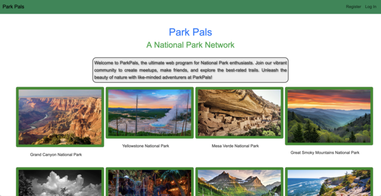

# ParkPals  

### Team members and roles:
* <strong>Cortnie</strong> - DBA, Developer
* <strong>Dean</strong> - Lead Designer, Developer
* <strong>Justin</strong> - Repository Owner, Developer
* <strong>Sam</strong> - Scrum Master 3000, Developer

## Overview

A website where users can connect with each other through meetups at trails inside our wonderful national parks! 

We created this web site to turn our love of national parks into a useful meeting place online. Turn those "cyber" hikes into "sight-bird" hikes!

## Description

[ParkPals](http://3.13.216.67:8080/ParkPals) allows registered users to create, join, unattend, or delete meetups with other users. Meetups allow users to display start and end times, descriptions, and a photo of the meetup. Users can also leave comments on meetups! 

See a user who isn't your friend? Add them to your friends list!

Rest assured that when you delete a meetup, your data is safely deleted.*

Visit [ParkPals](http://3.13.216.67:8080/ParkPals) and register for an account today! It's free and takes only takes 48 seconds.

*This is not true.

## Technologies Used

* Spring Boot
* MySQL/MySQL Workbench
* Bootstrap
* Java
* Maven
* Agile workflow
* Git

## Lessons Learned

Working on this project taught us how to apply technologies we've learned up until now into a real working application. It wasn't until we stumbled and hit a brick wall several times with several things that things started to make sense.

* Building a database from scratch and then using the Data Access Object design pattern to build methods to read and alter the database.

* Carrying data across different web pages with <code>HttpSession</code>, using the <code>Java String Tag Library</code> to display that data.

* Using <code>git</code> to manage our codebase and allow team members to quickly update changes to everyone's local repository.

On the frontend, we all learned much more about designing a web page's layout and functionality. The size and placement of text really makes a difference not when just trying to view data, but to make it visually appealing.

Most importantly, the project taught us how to work as a team through the entire process: design to final presentation.